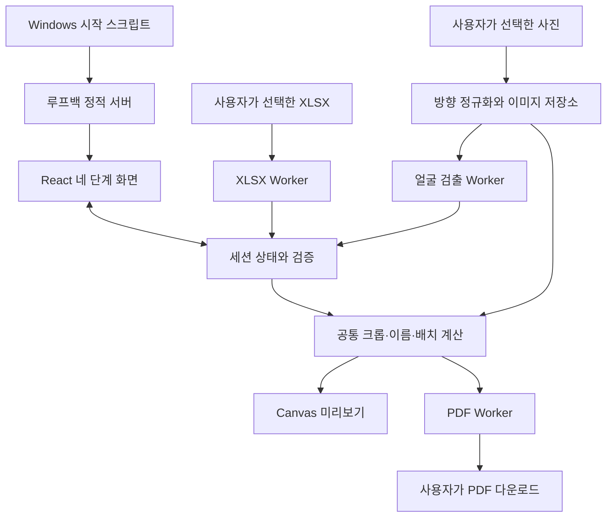

# 조직보드 사진 제작 자동화 웹페이지 TRD

- 문서 버전: v0.9
- 작성일: 2026-09-15
- 상태: 기술 설계안 작성 완료 · 기술 시험 및 실물 인쇄 검증 대기
- 기준: [PRD v1.0](prd.md), [FRD v0.9](frd.md)의 F1~F8, 필수 기능 68개
- 목적: 기능 요구사항을 구현 가능한 모듈, 데이터 계약, 처리 알고리즘과 검증 기준으로 구체화한다.
- 현재 저장소에는 요구사항 문서만 있다. 아래 파일 구조, 명령, 타입과 성능 수치는 구현 계획이며 구현·측정 완료를 뜻하지 않는다.

## 1. 설계 범위와 결정 상태

### 1.1 제품에서 확정된 제약

- Windows PC 한 대에서 담당자 한 명이 사용하는 localhost 웹앱이다.
- 사진, 이름, 직군, 계약형태만 처리한다. 부서·팀·직책은 수집하지 않는다.
- XLSX 입력, 사진 이름 매칭, 얼굴 위치 검출, 수동 크롭, PDF 생성을 브라우저에서 수행한다.
- 직원정보·사진·작업 상태는 메모리에만 둔다. 서버 업로드 API, 데이터베이스, 로그인, 자동 저장은 만들지 않는다.
- 설치된 앱은 인터넷 연결 없이 핵심 기능을 수행한다. 사용자가 명시적으로 내려받는 XLSX 양식과 PDF는 파일로 저장한다.
- 결과는 25 × 38mm 카드, A4 가로 297 × 210mm, 7열 × 3행, 페이지당 21명이다.
- 배경 제거, 얼굴 신원 식별, 외부 배포, 개별 이미지 다운로드는 제외한다.

### 1.2 이번 TRD의 설계 판단과 확인할 차이

| 항목 | 판단 | 상태·이유 |
|---|---|---|
| 문서 위치 | `doc/` 사용 | 사용자 요청 반영. PRD·FRD의 경로 표기만 수정 |
| FRD 승인 | v0.9 유지 | TRD 작성 요청을 FRD v1.0 승인으로 해석하지 않음 |
| 내부 높이 | 사진 26.3, 칩 2.9, 상단 1.0, 이름 7.8mm | 원문 수치 합은 39.2mm로 38mm를 초과. 전체·사진·칩 치수를 유지하는 조정안이며 시안·인쇄 검증 필요 |
| 모델 로딩 실패 | 수동 편집 허용 | FRD F4.1 우선. FRD ⑥의 모델 준비 전 편집 금지는 자동 편집에만 적용 |
| 오프라인 | 배포 자산 전부 로컬 포함 | FRD의 범위 축소 후보와 달리 PRD 성공 기준 및 F8.8을 유지 |
| XLSX 추가 불러오기 | 가져오기 미리보기 후 현재 목록 뒤에 추가 | 원문 미정 사항의 기본안. 이름 기준 병합·덮어쓰기 금지 |
| 사진·직원 상한, 브라우저 최소 버전 | 시험 기준을 먼저 정의 | 측정 없이 최종 지원 한계로 확정하지 않음 |

참고 Google Slides는 이번 확인에서 내용을 가져오지 못했다. 색상과 치수는 로컬 PRD·FRD를 기준으로 하며 슬라이드와의 시각적 일치 검증은 미완료다. 이름 영역 조정은 원문에 허용된 0.1~0.5mm 미세 보정 범위를 넘으므로 별도 디자인 결정으로 기록한다.

## 2. 기술 스택

| 역할 | 채택 설계안 | 적용 범위·검증 |
|---|---|---|
| 화면·빌드 | React + TypeScript + Vite | 네 단계 SPA, TypeScript strict, 별도 `tsc --noEmit` |
| 상태 | React Context + reducer | 직원을 ID로 관리하며 파일 버퍼는 별도 메모리 저장소에 보관 |
| 편집 인터랙션 | react-easy-crop + Canvas API | 라이브러리 좌표를 공통 원본 크롭 좌표로 변환하는 어댑터 작성 |
| 얼굴 검출 | `@mediapipe/tasks-vision` Face Detector | IMAGE 모드, 로컬 모델·WASM, 전용 Worker에서 한 장씩 처리 |
| XLSX | ExcelJS | 브라우저 document workbook으로 읽기·양식 쓰기. 동적 import 및 Worker 분리 |
| PDF | `pdf-lib` + `@pdf-lib/fontkit` | 실제 pt 좌표, 이미지 삽입, 사용자 글꼴 포함 |
| 이름 글꼴 | Nanum Gothic ExtraBold 800 TTF | 화면과 PDF에 같은 원본 글꼴 사용, 글리프 존재 여부 사전 검사 |
| 로컬 실행 | Node.js 정적 서버 + Windows 시작·종료 스크립트 | 완성된 `dist/`만 제공. 개발 서버를 사용자 실행 방식으로 삼지 않음 |
| 검증 | Vitest, Testing Library, Playwright | 계산·상태 전이·UI·네트워크 검증. PDF 독립 파서 검사는 별도 도구 사용 |

Vite는 TypeScript 변환 외에 타입 검사를 별도로 운영하는 개발 구성을 사용한다. 선택한 Vite 릴리스의 Node 지원 범위를 설치 시 확인하고 정확한 버전을 고정한다. [Vite 공식 안내](https://vite.dev/guide/)

react-easy-crop은 이동·확대 및 크롭 결과를 제공한다. 어댑터는 비율 좌표를 우선 사용하여 정수 픽셀 반올림으로 편집 복원 위치가 바뀌지 않게 한다. [공식 저장소](https://github.com/ValentinH/react-easy-crop)

XLSX 대안은 SheetJS CE이다. ExcelJS는 읽기와 양식 생성, 표시 시트 상태 확인을 한 라이브러리로 처리할 수 있어 우선 선택한다. 브라우저에서는 streaming workbook에 의존하지 않는다. ExcelJS의 MIT 라이선스와 잠금 버전의 전이 의존성을 확인하며, 보안 문제가 없다고 선결론을 내리지 않는다. 번들·파싱 시험에 실패하면 동일한 `SpreadsheetAdapter` 계약으로 SheetJS CE를 비교한다. [ExcelJS 공식 문서](https://raw.githubusercontent.com/exceljs/exceljs/master/README.md), [SheetJS 설치 안내](https://docs.sheetjs.com/docs/getting-started/installation/)

버전은 설치 시 정확한 번호와 lockfile로 고정한다. 모델·WASM·글꼴은 경로, 출처, 라이선스, SHA-256을 자산 목록에 기록한다. 실행 중 `latest` CDN이나 원격 폰트 URL을 사용하지 않는다. 업데이트는 개발자가 재검증한 앱 묶음을 교체하는 방식이다.

## 3. 시스템 구조



정적 서버는 GET/HEAD로 앱 파일만 반환한다. 직원 데이터를 받는 HTTP API는 없다. Worker 메시지는 같은 브라우저 안의 통신이며 외부 전송이 아니다. UI는 외부 URL을 입력받아 이미지를 읽지 않는다.

### 3.1 구현 예정 폴더

```text
doc/                         PRD, FRD, TRD
src/
  app/                       App, 단계 이동, 전역 오류 경계
  features/employees/        직접 입력, XLSX 가져오기 결과
  features/matching/         업로드, 자동·수동 연결
  features/editor/           편집기, 경고 확인, 직원 이동
  features/print/            페이지 미리보기, 다운로드
  domain/                    타입, 입력 검증, 매칭, 색상, 출력 조건
  imaging/                   EXIF 방향 정규화, 크롭 계산, Canvas 렌더
  layout/                    mm 상수, 이름 배치, 공통 RenderPlan
  state/                     reducer, selectors, 자산 메모리 저장소
  adapters/                  cropper, spreadsheet, face detector, PDF
  workers/                   얼굴 검출, XLSX, PDF Worker
public/assets/               fonts/, models/, mediapipe/wasm/
scripts/                     로컬 서버, Windows 실행·종료
tests/                       unit/, integration/, e2e/, fixtures/
THIRD_PARTY_NOTICES.md        라이선스·자산 출처
```

UI에서 PDF 라이브러리를 직접 호출하지 않는다. `domain/`과 `layout/`은 DOM 없이 계산할 수 있어야 하며 브라우저 배율을 입력으로 받지 않는다.

## 4. 세션 데이터와 불변 조건

다음 타입은 구현 계약의 개요다. 직원 이름이나 파일명을 식별자로 사용하지 않는다.

```ts
type Job = '디자인' | '서비스' | '개발' | '백오피스' | 'QA';
type Contract = '정규직' | '계약직' | '아르바이트' | '파견직' | '인턴';
type Rect = { x: number; y: number; width: number; height: number };
type Employee = {
  id: string; order: number; name: string; matchKey: string;
  job: Job; contract: Contract; sourceRow?: number;
};
type Photo = {
  id: string; fileName: string; matchKey: string;
  width: number; height: number; assetRevision: number;
  status: 'reading' | 'ready' | 'error'; ignored: boolean;
};
type Link = {
  employeeId: string; photoId: string; mode: 'auto' | 'manual';
  revision: number; needsReview: boolean;
};
type Edit = {
  employeeId: string; photoId: string; linkRevision: number;
  revision: number; crop: Rect; autoCrop?: Rect;
  detection: 'queued' | 'running' | 'single' | 'none' | 'multiple' | 'error';
  manuallyEdited: boolean;
  confirmedRevision?: number; lowResolutionConfirmedRevision?: number;
};
type Session = {
  epoch: number; revision: number; step: 1 | 2 | 3 | 4;
  employees: Employee[]; photos: Photo[]; links: Link[]; edits: Edit[];
  pdfStatus: 'idle' | 'generating' | 'ready' | 'error';
};
```

- ID는 세션 내 UUID이다. 직원 배열의 안정된 순서가 PDF 순서이며 삭제 후 남은 상대 순서를 유지한다.
- 원본 `File`, ImageBitmap, Blob URL과 PDF Blob은 메모리 자산 저장소에서 ID로 참조한다. reducer에 Base64 사진을 넣지 않는다.
- 링크는 직원 ID와 사진 ID 각각에 대해 유일하다. 확인 후 연결 교체를 하나의 reducer action으로 적용한다.
- 무시한 사진은 자동 매칭 후보에서 제외한다. 수동으로 다시 사용할 때 무시 상태를 해제한다.
- 재연결은 해당 직원의 편집·확인 상태를 폐기한다. 사진 자체의 방향 정규화 결과는 재사용할 수 있다.
- Worker 응답에는 `epoch`, `photoId`, `assetRevision`, `linkRevision`, 요청 당시 `editRevision`을 넣는다. 현재와 다르면 폐기한다. 늦게 도착한 검출 결과가 수동 편집을 덮어쓰지 못하게 한다.
- 이름 변경은 이름 배치와 매칭 충돌을, 직군·계약형태 변경은 색상과 RenderPlan을 무효화한다. 크롭 변경은 해상도와 경고 확인을 다시 계산한다.
- PDF는 생성 시작 시 세션 revision의 스냅샷을 사용한다. 생성 중 입력 변경·초기화·중복 생성은 잠그고 `finally`에서 해제한다.

## 5. 직원 입력과 XLSX 처리 — F2

### 5.1 입력과 파싱

1. 표시 이름은 앞뒤 공백 제거와 연속 공백 정리만 수행한다. 언어·대소문자·기호를 표시 목적으로 바꾸지 않는다.
2. 이름 공백, 허용 직군·계약형태 외 값은 오류다. 동명이인은 유효 입력이다.
3. 확장자 `.xlsx`와 ZIP 기반 XLSX 구조를 검사한다. `.xls`, `.xlsm`, CSV, 암호화되거나 손상된 문서는 거절한다.
4. workbook 순서에서 `visible`인 첫 시트를 읽는다. 표시 시트가 없으면 파일 오류다.
5. 첫 행을 헤더로 한다. 정리한 `이름`, `직군`, `계약형태` 열을 정확히 한 개씩 요구한다. 열 순서는 자유, 추가 열은 버리고 경고한다. 중복·누락 헤더와 필수 영역 병합 셀은 거절한다.
6. 세 필수 셀이 모두 빈 행은 무시한다. 문자열 셀을 받고 rich text는 표시 문자열로 합친다. 수식·오류·날짜·숫자·하이퍼링크 객체는 행 오류로 처리하며 수식 결과를 계산하거나 외부 링크를 열지 않는다.
7. 파싱 결과는 `validRows`, `invalidRows(sourceRow, column, code)`, 요약으로 반환한다. 오류 안내에는 원본 이름·셀 값을 포함하지 않는다.
8. 정상 행과 오류 행을 미리 보여준 뒤 가져오기 적용 시 정상 행을 순서대로 추가한다. 오류 행은 화면에서 수정해 원래 가져오기 순서에 넣거나 사용자가 제외한다. 미해결 오류 행은 다음 단계 진입을 막는다.
9. 재업로드는 해당 가져오기 배치의 재시도인지 신규 추가인지 구분한다. 배치 재시도 시 기존 정상 행을 중복 추가하지 않는다. 이름으로 기존 직원을 갱신하지 않는다.

템플릿의 첫 표시 시트는 헤더만 있는 입력용 시트로 제공한다. 별도 안내 시트에 가상의 예시와 허용값을 둬 예시가 직원으로 자동 등록되지 않게 한다.

### 5.2 파서 보호 기본안

XLSX 5MiB, 데이터 1,000행, ZIP 선언상 해제 크기 50MiB, 엔트리 2,000개를 시험용 상한으로 둔다. ZIP 사전 검사는 신뢰 가능한 크기 검증 모듈로 수행하고 초과 시 ExcelJS에 넘기지 않는다. 선언 정보만으로 악성 압축을 완전히 막는다고 보지 않으며 Worker 실행 10초 제한과 실제 리소스 시험을 함께 적용한다. 실패 시 Worker를 종료하고 기존 직원 목록을 유지한다. 상한은 §13의 검증 후 확정한다.

## 6. 사진 검사와 매칭 — F3

### 6.1 읽기

- `.jpg`, `.jpeg`, `.png`를 허용하고 MIME만 신뢰하지 않는다. 파일 시그니처와 실제 디코딩 결과를 함께 확인한다.
- 빈 파일명·빈 확장자 제거 결과, 0바이트, 지원하지 않는 형식과 손상 파일은 개별 실패다.
- 업로드 묶음 검사를 완료한 뒤 전체 사진 집합으로 매칭한다. 파일이 도착한 순서 때문에 첫 사진이 중복 검사 전에 확정되지 않게 한다.
- PNG 투명 영역은 출력 시 흰색 바탕과 합성한다. EXIF 보정 뒤 모든 좌표 기준을 일치시키며 색감·피부 보정은 수행하지 않는다.

### 6.2 매칭 알고리즘

```text
normalizeMatch(s) = NFC(s).trim().replace(연속 공백, ' ').toLowerCase()
직원 키 = normalizeMatch(이름)
사진 키 = normalizeMatch(마지막 확장자만 제거한 파일명)
```

키별 전체 직원 수와 무시하지 않은 정상 사진 수가 각각 1이고 양쪽이 미연결일 때만 자동 연결한다. 괄호·숫자·기호는 그대로 비교한다. 유사 이름 추천이나 얼굴 신원 비교는 하지 않는다.

새 직원·사진 추가와 이름 수정 때 충돌을 재검사한다. 기존 자동 연결이 더 이상 유일·정확하지 않으면 해제하고 수동 확인 대상으로 돌린다. 수동 연결은 유지하되 이름 변경 사실과 중복 상태를 표시한다. 자동 연결 중 사용자가 편집한 결과를 잃는 변경에는 영향 대상을 먼저 보여준다. 수동 확정 전 PDF를 허용하지 않는다.

연결 해제는 링크와 직원 편집을 제거하며 사진 파일은 미매칭 목록에 남긴다. 직원 삭제 역시 연결만 해제한다. 사진 삭제는 연결된 직원이 미매칭이 된다는 확인 후 자산까지 해제한다.

## 7. 사진 좌표와 얼굴 자동 크롭 — F4

### 7.1 방향과 좌표 기준

디코더가 EXIF를 적용했는지 확인하는 단일 어댑터를 사용한다. EXIF 1~8(반전 포함) fixture로 방향 적용을 검증하며 수동 회전을 중복 적용하지 않는다. 방향이 적용된 원본의 좌상단을 `(0,0)`, 너비·높이를 `W,H`로 한다. 원본 파일은 수정하지 않는다.

탐지용 사본은 긴 변 최대 1,280px로 축소하는 초기안을 사용한다. 탐지 bounding box와 정규화된 눈 좌표는 원본 좌표로 역변환한다. 검출 좌표, 편집 좌표, PDF 크롭 모두 방향 보정된 원본 기준의 실수 좌표를 사용한다.

### 7.2 계산식

사진 영역 비율 `r = 22.4 / 26.3`이다. 중앙 cover 크롭의 원본 높이와 너비는 다음과 같다.

```text
hCover = min(H, W / r)
wCover = r * hCover
cover = ((W-wCover)/2, (H-hCover)/2, wCover, hCover)

단일 얼굴: 얼굴 높이 = faceH, 얼굴 가로 중심 = faceX, 두 눈의 중점 높이 = eyeY
hDesired = faceH / 0.55
hCrop = clamp(hDesired, hCover / zoomMax, hCover)
wCrop = r * hCrop
x = clamp(faceX - 0.50 * wCrop, 0, W - wCrop)
y = clamp(eyeY - 0.38 * hCrop, 0, H - hCrop)
```

눈 기준점이 없거나 좌표가 유효하지 않으면 자동 성공으로 표시하지 않는다. 가장자리 clamp 때문에 목표 얼굴 구도가 크게 달라지거나 얼굴 경계가 잘리면 확인 필요로 표시한다. 허용 편차는 샘플 시험에서 확정하며 초기값은 목표 얼굴 비율·눈높이에서 각각 5%p 초과이다. 얼굴 높이는 머리카락 전체 높이와 다르므로 55% 수치만으로 머리·어깨 보존을 보장하지 않는다.

### 7.3 검출과 실패 상태

Face Detector는 얼굴 경계와 눈 등의 기준점을 반환하며 `detect()`는 동기 호출이므로 전용 Worker로 격리한다. 모델과 WASM은 동일 릴리스 자산을 localhost에서 읽는다. 초기 모드는 IMAGE, confidence 0.5이며 모델의 샘플 적합성은 별도 검증한다. [MediaPipe 공식 문서](https://developers.google.com/edge/mediapipe/solutions/vision/face_detector/web_js)

| 결과 | 초기 크롭 | 완료 조건 |
|---|---|---|
| 유효한 단일 얼굴 | 얼굴 기준 크롭 | 다른 경고 없으면 자동 완료 |
| 얼굴 없음 | 중앙 cover | 위치 확인·필요한 수정 후 `이 사진 사용` |
| 여러 얼굴 | 중앙 cover | 사용할 인물을 수동 조정하고 `이 사진 사용` |
| 모델·WASM·추론 실패 | 중앙 cover | 재시도 또는 수동 확인. 자동 편집 실패 안내 |
| 기준점 불량·구도 제한 | 가능한 크롭 또는 cover | 사용자 확인 |

미탐지와 다중 얼굴 안내 문구는 FRD F4.5·F4.6을 그대로 사용한다. 한 장당 추론 제한 10초를 초기안으로 두고 시간 초과 시 Worker를 재생성해 다음 항목을 처리한다. 모델 전체 초기화 실패는 무한 재시도하지 않는다.

## 8. 수동 편집과 경고 확인 — F5

- 저장할 기준값은 원본 좌표 `Rect`이다. 화면 이동량과 라이브러리 zoom은 어댑터에서 변환하며 DOM 픽셀을 출력 좌표로 저장하지 않는다.
- 확대율은 중앙 cover를 1로 두고 초기 범위를 1~5로 한다. `zoom = hCover / crop.height`이며 변경할 때 중심을 유지하고 경계를 clamp한다.
- 프레임이 포커스된 경우 방향키 한 번은 현재 크롭 너비·높이의 0.5%, Shift 병용은 2.5%에 해당하는 사진 이동이다. 사진 이동 방향과 크롭 원점 이동 방향은 반대다. 입력칸에서는 방향키를 가로채지 않는다.
- 드래그·휠·버튼 결과를 하나의 Rect에 반영하고 이전·다음 직원 이동 시 즉시 보존한다.
- 자동 초기화는 가장 최근 자동 크롭으로 돌아간다. 실패한 검출은 cover를 사용한다.
- 원본 기준 초기화는 자동·수동 크롭과 확인값을 지우고 cover로 돌아간다. 다시 자동 편집을 요청할 때에만 검출을 실행한다.
- 사진 교체, 크롭 변경, 초기화 후에는 해당 경고 확인 revision을 무효화한다. 직군 변경 때문에 사진 확인을 다시 요구하지 않는다.
- 저해상도 확인과 얼굴 확인을 별개로 기록한다. `이 사진 사용`이 미매칭, 이름 넘침, 처리 중 오류까지 무시하는 버튼이 되지 않게 한다.

## 9. 공통 출력 모델 — F6

### 9.1 카드 내부 좌표

카드의 좌상단 기준 mm이다. 아래 이름 영역은 §1.2의 조정안이다.

| 요소 | x | y | 너비 | 높이 |
|---|---:|---:|---:|---:|
| 카드 전체 경계 | 0 | 0 | 25 | 38 |
| 사진 | 1.3 | 1.0 | 22.4 | 26.3 |
| 컬러칩 | 1.3 | 27.3 | 22.4 | 2.9 |
| 이름 영역 | 1.3 | 30.2 | 22.4 | 7.8 |

이름 실사용 높이는 위아래 0.2mm씩 제외한 7.4mm이다. 외곽선은 0.6pt, 진한 회색 `#444444`를 초기안으로 사용한다. stroke 중심선을 선 굵기의 절반만큼 안쪽에 그려 외곽의 실제 크기가 25 × 38mm를 넘지 않게 한다.

### 9.2 색상

순수 함수 `resolveChipColor(job, contract)`에서 계약형태 전용색을 우선한다.

| 직군 | HEX | 계약형태 | HEX |
|---|---|---|---|
| 디자인 | `#FFAE01` | 정규직 | 직군색 |
| 서비스 | `#FF01A2` | 계약직 | `#E6B8AF` |
| 개발 | `#0196FF` | 아르바이트 | `#737373` |
| 백오피스 | `#47B50B` | 파견직 | `#A4C2F4` |
| QA | `#9900FF` | 인턴 | `#00FFFF` |

PDF에는 HEX 각 채널을 255로 나눈 RGB 값을 사용한다. 임원·기타는 허용 목록에 추가하지 않는다.

### 9.3 글꼴과 긴 이름

Nanum Gothic ExtraBold 800 TTF를 앱과 PDF에 함께 포함한다. 자산의 실제 파일과 OFL 조건을 확인하고 저작권·라이선스를 함께 제공한다. [Nanum Gothic 공식 배포 파일](https://github.com/google/fonts/tree/main/ofl/nanumgothic)

1. 폰트 로드가 완료되어야 텍스트 배치 성공을 판정한다.
2. 사용할 모든 문자에 글리프가 있는지 검사한다. 한글·영문·일문 전체를 지원한다고 가정하지 않는다. 누락 글리프는 이름 행 오류로 표시하고 PDF를 막는다. 대체 글꼴 도입은 별도 검증 결정이다.
3. 임베딩한 글꼴의 실제 advance width로 12pt 한 줄을 검사한다.
4. 넘으면 10pt 두 줄, 이후 0.5pt씩 9pt까지 검사한다. 공백 경계를 우선하고 불가능하면 grapheme 경계로 분할한다. 줄은 최대 두 개이며 문자를 생략하지 않는다.
5. 각 줄 너비와 실제 ascent/descent, 줄간격을 포함한 전체 높이를 함께 검사한다. 초기 줄 높이 1.05배를 사용하되 글리프 경계 검사를 통과해야 한다.
6. 여러 분할 후보 중 최대 줄 너비가 가장 작은 것을 선택하고 동일하면 앞선 분할점을 선택해 결과를 결정적으로 유지한다.
7. 모든 후보가 실패하면 `NAME_OVERFLOW`로 PDF를 막고 이름 수정 위치를 안내한다.

줄 문자열, 폰트 크기와 기준선 좌표를 `NameLayout`으로 만들어 화면·PDF에서 그대로 사용한다. CSS 자동 줄바꿈에 결과를 맡기지 않는다. PDF는 `fontkit` 등록 후 사용자 글꼴을 임베딩하며 subset 사용 가능성과 출력 호환성을 시험한다. [pdf-lib 공식 안내](https://pdf-lib.js.org/)

### 9.4 이미지 해상도와 공통 RenderPlan

출력 영역 22.4 × 26.3mm를 300ppi로 환산한 최소 정수 픽셀은 `ceil(mm / 25.4 * 300)`으로 265 × 311px이다. 원본 크롭의 너비나 높이 어느 한쪽이 기준 미만이면 저해상도 경고를 표시한다. 미리보기 사본 크기로 판정하지 않는다.

`RenderPlan`은 직원 ID, photo revision, crop Rect, 카드·사진·칩 사각형, RGB 색, NameLayout, 페이지 위치를 갖는다. 화면과 PDF 모두 같은 Plan을 소비한다. Canvas는 최종 Rect로 원본에서 잘라 출력 이미지를 만든다. 300ppi 이상 원본은 목표 크기 근처로 등비 축소할 수 있으며 300ppi 미만을 확대해 경고를 숨기지 않는다. 픽셀 반올림 오차는 1px 이내로 검증한다. 사진만 래스터화하고 이름·컬러칩·외곽선은 PDF 벡터로 그린다.

## 10. A4 배치와 PDF — F7

### 10.1 실제 단위 계산

```text
pt(mm) = mm * 72 / 25.4
gridWidth  = 7 * 25 + 6 * 2.2 = 188.2mm
gridHeight = 3 * 38 + 2 * 1.0 = 116mm
left = (297 - 188.2) / 2 = 54.4mm
top  = (210 - 116) / 2 = 47mm

직원 인덱스 i는 0부터 시작
page = floor(i / 21)
slot = i % 21
column = slot % 7
row = floor(slot / 7)
cardX = 54.4 + column * 27.2
cardY = 47 + row * 39
```

PDF 좌표는 좌하단 기준이므로 사각형에 `xPt = pt(x)`, `yPt = pt(210 - yTop - height)`를 사용한다. 텍스트 기준선 역시 상단 좌표에서 PDF y로 변환한다. A4 MediaBox는 약 841.8898 × 595.2756pt이며 내부 계산값을 일찍 반올림하지 않는다.

직원이 0명이면 생성 불가다. 나머지는 `ceil(N/21)`페이지이며 마지막 페이지에서도 전체 7 × 3 그리드의 원점은 고정한다. 직원 없는 슬롯은 그리지 않는다.

### 10.2 출력 조건과 생성 순서

`getBlockingIssues(session)`을 단계 이동·미리보기·PDF 시작 시 공통 호출한다.

- 직원 0명, 미해결 입력 행, 미매칭 직원, 충돌 링크, 미확인 남는 사진
- 연결된 사진 읽기·자동 처리 진행 중, 사용할 수 없는 크롭, 미확인 얼굴 경고
- 미확인 저해상도, 폰트 준비 실패·누락 글리프, 이름 넘침
- 이미 PDF 생성 중

모델 실패를 수동 확인으로 해결한 사진은 출력할 수 있다. 이름 넘침과 글꼴 실패에는 확인만으로 통과하는 경로를 두지 않는다.

생성 순서는 검증 → 스냅샷 잠금 → RenderPlan 확정 → 원본에서 사진별 크롭 → 페이지 작성 → 폰트 포함·직렬화 → Blob 다운로드이다. 사진은 한 장씩 처리해 중간 버퍼를 해제한다. 생성 실패 시 부분 PDF는 내려받지 않고 입력·편집 상태를 유지한다.

파일명은 사용자 PC의 로컬 날짜로 `조직보드_YYYY-MM-DD.pdf`이다. PDF metadata와 파일명에 직원 이름을 넣지 않는다. 페이지 미리보기는 현재/전체 페이지, 이전·다음 이동을 제공하며 화면 확대는 PDF 치수에 영향을 주지 않는다. 다운로드 후 A4 가로, 실제 크기/100%, 페이지 맞춤·축소 해제, 85% 축소 금지를 안내한다. 브라우저 다운로드 시작은 실제 인쇄 완료로 간주하지 않는다.

## 11. 단계 전이와 오류 계약 — F1·F8

| 전이 | 조건 |
|---|---|
| 직원정보 → 매칭 | 직원 1명 이상, 미해결 입력 오류 없음 |
| 매칭 → 편집 | 모든 직원 일대일 연결, 남는 사진 삭제 또는 무시 확인 |
| 편집 → 인쇄 미리보기 | 연결된 사진 처리 완료, 필수 확인·이름 배치 검사 통과 |
| 이전 단계 | PDF 생성 중 외에는 허용, 세션 유지 |
| 새 작업 | 삭제 대상 범위 확인 후 Worker 종료·epoch 증가·상태 및 자산 제거 |

수정으로 이전 완료 조건이 깨지면 이후 단계를 미완료로 표시하고 수정할 화면으로 안내한다. 모든 화면에 전체·연결·미매칭·자동 완료·확인 필요 수를 파생 계산한다. 중복 상태를 가산해 전체 직원 수를 초과하는 요약을 만들지 않는다.

오류 구조는 `{ code, stage, rowOrIndex, retryable }`로 제한한다. 한국어 메시지에는 원인과 다음 행동을 함께 제공하고 색상 외 아이콘·텍스트를 사용한다. 직원 이름과 사진은 정상 목록·확인 UI에서 표시할 수 있지만 오류 상세·로그에는 넣지 않는다.

| 오류 코드 예 | 복구 |
|---|---|
| XLSX_INVALID / ROW_INVALID | 원본 행·열 수정 또는 오류 행 제외 |
| PHOTO_UNSUPPORTED / DECODE_FAILED | 해당 파일 교체, 정상 사진 유지 |
| MATCH_CONFLICT | 수동 연결 확인 |
| MODEL_UNAVAILABLE / FACE_NONE / FACE_MULTIPLE | 재시도 또는 수동 편집·확인 |
| LOW_RESOLUTION | 사진 교체 또는 경고 확인 |
| FONT_UNAVAILABLE / GLYPH_MISSING / NAME_OVERFLOW | 자산 복구 또는 이름 수정 |
| PDF_FAILED | 상태 보존 후 재시도 |

## 12. 개인정보·메모리·로컬 실행

### 12.1 보관과 해제

- localStorage, sessionStorage, IndexedDB, Cache API에 사용자 데이터를 쓰지 않는다. Service Worker는 도입하지 않는다.
- 외부 분석 SDK, 원격 오류 수집, 업로드 endpoint를 포함하지 않는다. 파일 경로·이름을 URL query, document title, console에 넣지 않는다.
- 파일 삭제·초기화 시 Object URL revoke, ImageBitmap.close, Canvas backing store 축소, 배열·Blob 참조 해제, Worker 종료를 수행한다.
- 새로고침·닫기 경고는 데이터가 있을 때만 `beforeunload`에 등록한다. 브라우저 종료 이벤트 실행이나 JS 메모리 즉시 소거는 보장하지 않으며 상시 데이터 소실 안내도 제공한다.
- 썸네일은 긴 변 256px, 편집 사본은 1,600px 초기안이다. 원본은 File로 보관하고 고해상도 디코딩은 동시 1장, 편집 캐시는 최대 2장으로 제한한다.
- 다운로드한 PDF와 사용자가 가진 원본 파일은 앱 초기화로 삭제하지 않는다.

### 12.2 실행·종료 방식

개발자 설치 시 호환 Node와 의존성을 설치하고 모델·폰트를 준비한다. 사용자 배포 묶음에는 빌드 결과, 검증된 Node 런타임, 시작·종료 스크립트, 자산과 라이선스를 포함하는 방식을 우선한다. 런타임 재배포 조건과 사내 실행 정책은 패키징 시험에서 확인한다.

1. 사용자가 시작 바로가기를 한 번 실행한다.
2. launcher는 자산 누락과 포트를 검사하고 정적 서버를 루프백에만 바인딩한다. 기본 포트 4173, 점유 시 소유 앱 확인 후 기존 창을 열거나 사용 가능한 로컬 포트를 선택한다.
3. 준비 확인 후 `http://localhost:<port>`를 기본 브라우저로 연다. IPv4·IPv6 localhost 해석을 지원 브라우저에서 검증한다.
4. 종료 바로가기는 이 launcher가 만든 서버 프로세스만 확인해 종료한다. 다른 Node 프로세스를 일괄 종료하지 않는다. 브라우저 탭은 사용자가 닫으며 세션 소실을 안내한다.
5. 사용자 실행 중 npm install, 원격 버전 확인, CDN 요청을 하지 않는다.

PID·포트 같은 실행 관리 정보만 임시 파일에 기록할 수 있다. 사용자 데이터는 쓰지 않는다. 정적 서버는 경로 순회 차단, 허용 Host 검사, 루프백 바인딩, 외부 origin CORS 미허용을 적용한다.

완성 빌드에는 CSP를 적용한다. 초기 정책은 `default-src 'self'; connect-src 'self'; img-src 'self' blob:; font-src 'self'; worker-src 'self'; script-src 'self' 'wasm-unsafe-eval'; style-src 'self' 'unsafe-inline'; object-src 'none'; base-uri 'none'; frame-ancestors 'none'`이다. WASM·Worker 로딩을 실제 빌드에서 검증해 필요한 지시어만 유지한다. 개발 HMR 정책은 별도로 둔다.

## 13. 성능과 지원 환경의 시험 기준

아래는 신규 제안값이며 측정 결과가 아니다. 최종 상한은 기술 시험 후 문서 버전을 올려 확정한다.

| 항목 | 초기 기준 |
|---|---|
| OS·화면 | Windows 11 x64, 메모리 8GB 이상, 1280 × 720 이상 |
| 브라우저 | 릴리스 검증 시점의 Edge·Chrome stable 및 직전 메이저 |
| 최소 버전 확정 | 위 네 조합의 정확한 빌드 번호·통과 결과를 검증 기록에 기재. 현재 번호 미확정 |
| 사진 개별 상한 | 20MiB, 24메가픽셀, 한 변 12,000px 이하 모두 만족 |
| 작업 규모 | 권장 100명, 정상 사진 총 500MiB 이내를 초기 안전 제한으로 시험 |
| 입력 반응 | 편집 조작 p95 100ms 이내 목표 |
| 얼굴 검출 | 모델 준비 후 21장 30초 이내 목표 |
| PDF | 21명 15초, 100명 60초 이내 목표 |
| 메모리 | 100명 시험에서 앱 관련 프로세스 합계 peak 1.5GB 이하 목표 |

파일 헤더 치수 검사 후 디코딩하고 전체 해상도 이미지 여러 장을 동시에 만들지 않는다. 제한 초과 파일은 해당 파일만 오류로 유지하고 나머지는 진행한다. 누적 용량은 현재 보관 File의 합으로 계산한다. 성능 미달이면 동시성·캐시를 조정하고 목표 미달을 기록하며 원본을 몰래 저화질로 교체하지 않는다.

## 14. 검증 계획과 FRD 추적

### 14.1 구현 전 기술 시험

| ID | 시험 | 통과 조건 | 현재 상태 |
|---|---|---|---|
| POC-01 | 로컬 묶음 실행 | 비개발자 시작·종료, 외부 네트워크 차단 후 입력·편집·PDF 완료 | 미실행 |
| POC-02 | 비식별 합성·사용 허가 샘플 5~10장 | 단일·없음·여러 얼굴·가로·세로·EXIF 1~8 처리, 실패 시 수동 가능 | 미실행 |
| POC-03 | 크롭 일치 | 재진입·창 크기·브라우저 배율 변경 후 기준 격자 사진의 화면/PDF 원본 좌표 차이 1px 이내 | 미실행 |
| POC-04 | 글꼴·이름 | 한글·영문·일문 샘플의 글리프 검사, 12/10/9pt 경계, 폰트 없는 PC에서도 PDF 표시 | 미실행 |
| POC-05 | 출력 치수 | 독립 PDF 파서로 치수 확인, 100% 인쇄 후 카드 가로·세로 오차 각각 ±0.5mm | 미실행 |
| POC-06 | XLSX | 표시 시트 선택, 정상·오류 혼합, 수식·손상·압축 한계, Worker 시간 제한 | 미실행 |
| POC-07 | 규모·메모리 | 1·21·22·100명, §13 목표 측정, 삭제·초기화 후 참조 해제 확인 | 미실행 |

실물 인쇄는 개발자가 시험 파일을 제공하고 사용자 PC·PDF 뷰어·프린터 조합에서 측정한다. 자동 테스트만으로 인쇄 성공을 선언하지 않는다. 시험용 눈금자 페이지는 검증 산출물로 분리하고 실제 업무 PDF에는 추가하지 않는다.

### 14.2 기능별 테스트 연결

| FRD 범위 | 구현 책임 | 검증 묶음 |
|---|---|---|
| F1.1~F1.6 (6) | launcher, 단계 guard, reducer, 요약 selector | T01 실행·종료, T02 이전 이동·오류 진입 차단·초기화 |
| F2.1~F2.10 (10) | employees, SpreadsheetAdapter | T03 CRUD·허용값·정규화, T04 양식·첫 표시 시트·오류 행·순서·재시도 |
| F3.1~F3.10 (10) | 이미지 검사, matcher, 링크 reducer | T05 파일 검사, T06 NFC·대소문자·기호·동명이인·중복·일대일·남는 사진 |
| F4.1~F4.8 (8) | 방향 어댑터, 얼굴 Worker, autoCrop | T07 단일·미탐지·다중·모델 실패·EXIF·부분 재시도 |
| F5.1~F5.8 (8) | editor, cropper adapter, 확인 revision | T08 이동·확대·키보드·두 초기화·직원 이동·경고 재확인 |
| F6.1~F6.8 (8) | 색상, NameLayout, RenderPlan | T09 모든 직군×계약 조합, T10 고정 크기·이름·경고·실시간 갱신 |
| F7.1~F7.10 (10) | pageLayout, PDF Worker, print UI | T11 0·1·21·22·42·43명, 치수·빈자리·파일명·포함 글꼴·생성 실패·인쇄 안내 |
| F8.1~F8.8 (8) | 자산 store, CSP, 로그, 정리 | T12 외부 요청·저장 금지·종료 경고·부분 실패·로컬 자산 |
| **총 68개** | | 각 범위의 모든 하위 기능을 테스트 체크리스트로 분해 |

추가 회귀 사례: 사진 처리 중 직원 삭제, 검출 중 수동 이동, 이름 수정으로 기존 자동 매칭 충돌, 경고 확인 후 재크롭, PDF 생성 중 연속 클릭, 실패 후 재생성, 초기화 직전 Worker 응답을 검증한다.

외부 전송 검증은 localhost 정적 요청만 허용하는 Playwright 네트워크 기록으로 수행한다. 화면 진입부터 XLSX·사진·모델·PDF·실패 처리까지 전체 흐름을 실행한다. 사용자 데이터가 로컬 서버로 POST되지 않는지도 확인한다. 오프라인 시험은 localhost 접근을 유지한 채 외부 목적지를 차단한다. 저장소 검사와 로그 검사는 가상의 식별 문자열이 새어 나오는지 확인한다.

### 14.3 구현 후 사용할 검사 명령 계약

`npm run typecheck`, `npm run lint`, `npm run test`, `npm run build`, `npm run test:e2e`를 개발 프로젝트 생성 시 제공한다. 현재는 package.json과 앱이 없어 실행하지 않았다. PDF 독립 파서·래스터 비교와 실물 측정 결과는 환경, 버전, 소요 시간, 산출물, 통과 여부를 함께 `doc/verification.md`에 기록할 예정이다.

## 15. 구현 순서와 완료 조건

1. **기술 시험:** POC-01~07로 스택·폰트·좌표·치수·리소스 제한을 검증한다. 특히 이름 7.8mm 영역의 시안을 확정한다.
2. **기반과 입력:** 정적 실행, 세션 reducer, 입력·XLSX, 오류 메시지 계약을 만든다.
3. **매칭과 편집:** 일대일 불변 조건, EXIF, Worker, 수동 편집·확인을 연결한다.
4. **출력:** 공통 RenderPlan, 글꼴·줄바꿈, A4 PDF·다운로드를 연결한다.
5. **검수와 패키징:** 네트워크·메모리·오프라인·사용자 실행·실물 인쇄를 검증한다.

제품 범위는 PRD, 기능 행동은 FRD를 따른다. 이번 TRD의 잠정값이 시험을 통과하고 내부 치수·폰트 지원·최소 브라우저·상한·실행 패키징 결정이 기록되면 TRD v1.0으로 확정한다. 68개 기능의 검증과 실물 인쇄가 모두 통과해야 MVP 완료로 판단한다.

## 16. 남은 결정과 주요 위험

| 항목 | 영향 | 해결 기준 |
|---|---|---|
| 이름 영역 7.8mm 조정 | 원문과 내부 치수 차이, 두 줄 가독성 | 디자인 확인 및 9·10pt 실물 인쇄 |
| 일문·확장 문자 글리프 | 이름 누락·대체 문자 출력 | 실제 글꼴 glyph coverage 검증, 필요하면 대체 글꼴 정책 결정 |
| 얼굴 55%·눈높이 38% | 머리·어깨 잘림, 과도한 확대 | 샘플 기록 후 수치 조정, 항상 수동 복구 |
| Worker·WASM·CSP 조합 | 검출 초기화 실패 | 완성 빌드·오프라인 시험, 실패 시 수동 편집 |
| XLSX 압축·대용량 사진 | 메모리 고갈·브라우저 종료 | 사전 검사·제한·직렬 처리, §13 상한 실측 |
| 사용자 실행 환경 | 스크립트·런타임 정책으로 실행 실패 | 실제 PC에서 한 번의 시작·종료 검증 |
| 프린터 자동 축소 | 물리 카드 크기 오차 | 100% 설정과 ±0.5mm 실측 |

이번 문서는 기술 설계와 검증 계획까지 작성한 결과다. 라이브러리 설치, 앱 구현, 기술 시험, 실물 인쇄, Git 초기화와 원격 저장소 작업은 수행하지 않았다.
